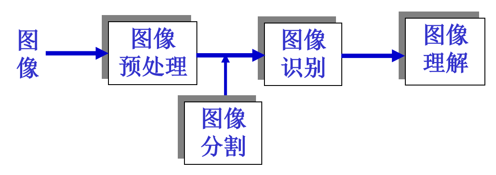
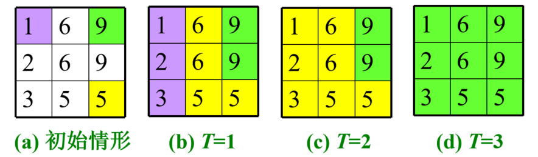
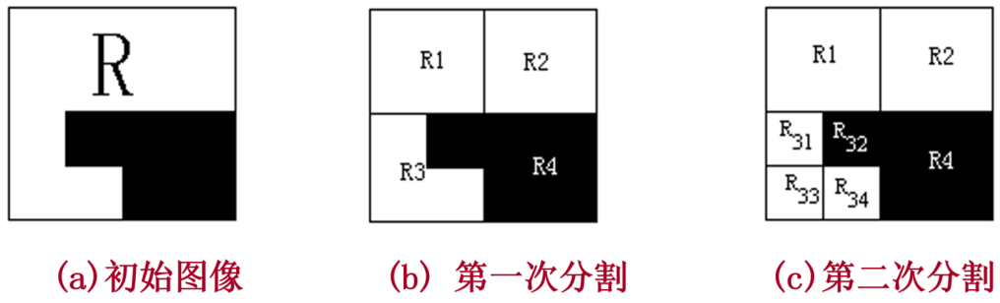

## 作用与特点
图像分割在数字图像处理中的作用

定义：将一幅图像分解为若干互不交叠的、有意义的、具有相同性质的区域
特点：
1. 分割出来的各区域对某种性质有相似性，区域内部是连通的且没有过多小孔
2. 区域边界明确
3. 相邻区域在分割所依据的性质表现具有明显差异

对于灰度图，相同性质一般通过灰度级来判断
## 阈值分割法
于阈值分割法而言，最重要的就是如何确定阈值，在数字图像处理领域，阈值确定方法分为人工阈值和自动阈值，自动阈值主要有以下两种方法：迭代阈值法和Otsu法
1. 迭代阈值法：要求目标和背景像素点数目近似相等。做出的假设是：若目标与背景像素出现的概率相等，则目标的平均灰度与背景的平均灰度的中值就是所求的最优阈值
2. Otsu法：使得各个像素类的类内方差最小/像素类的类间方差最大。编程实现时不断迭代0~255各个灰度值，在这个过程中找到最优阈值
## 区域分割
对比阈值分割：区域分割考虑到了空间关系，使得图像分割过程中的多阈值成为可能
区域分割算法主要有区域生长法和区域分裂合并法：
1. 区域生长法：选定一个或者多个像素点作为种子，按给定的相似性准则（一般为灰度级差值）增长区域，直到其周围没有再可以归并的像素点为止
区域生长法示例

2. 区域分裂法：区域的某些特性差别大，不满足一致性，需要分裂为子区域，最终得到的各个子区域都是具有一致性的
3. 区域合并法：将相邻的具有相似性质的区域合并为一个大的区域（常用的衡量两个区域相似性的方法：比较两个区域的灰度均值）
图像分裂示例

4. 区域分裂合并法：将2和3合在一起，得到的一种区域分割的做法
